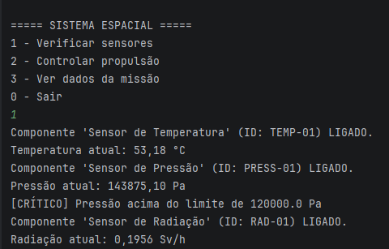
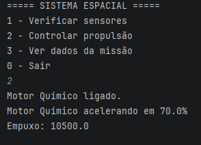
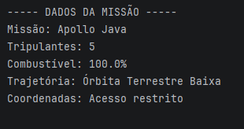

# Sistema de Monitoramento Espacial

Projeto desenvolvido com o objetivo de simular o monitoramento de sistemas espaciais, permitindo o controle de sensores, propulsão e dados da missão, utilizando os principais conceitos de Programação Orientada a Objetos em Java.

## Conceitos aplicados
- Abstração
- Herança
- Encapsulamento
- Interfaces
- Polimorfismo

## Funcionalidades
- Monitoramento de sensores
- Sistema de alertas
- Controle de propulsão
- Gerenciamento da missão espacial

## Tecnologias
- Java
- IntelliJ IDEA

## Prints do Sistema

### Menu Principal e Sensores

### Sistema de Propulsão

### Dados da Missão
